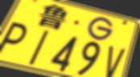
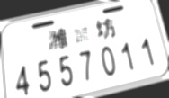
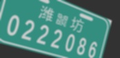
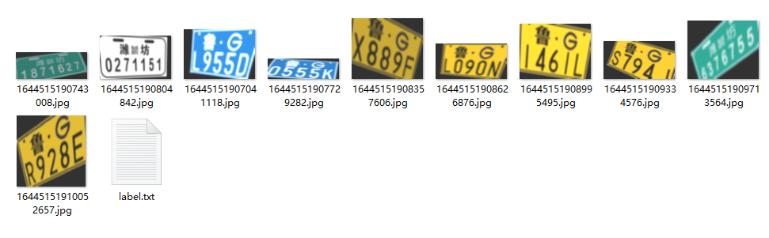
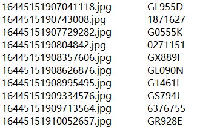

# A NonMotor plate Generator made for NonMotor violation detection

## <span id="resultslink">Demo</span>

<p align="center">

<br>
</p>

<p align="center">

<br>
</p>

<p align="center">

<br>
</p>

<p align="center">

<br>
</p>

## <span id="resultslink">Usage</span>

### Inference

```
#dependences
pip install -r requirements.txt

#run
python plateGenerator,py --amount 100 --save_dir ./plate --plate_type White --label_txt_path ./plate/label.txt --rotate_angle 30 
```

Generate plate(In the ratio of white:green:yellow:blue = 3:3:3:1) and save corresponding number to your_label.txt
## <span id="resultslink">Plate & label</span>
<p align="center">

<br>
</p>
<p align="center">

<br>
</p>
<p>
Letters used :'A', 'B', 'C', 'D', 'E', 'F', 'G', 'H', 'J', 'K', 'L', 'M', 'N', 'P', 'Q', 'R', 'S', 'T', 'U',
'V', 'W', 'X', 'Y', 'Z'
</p>

<p>
Image processing method : pespective & affine transformation, Gaussian blur, brightness augment, zoom & resize, ...
</p>
